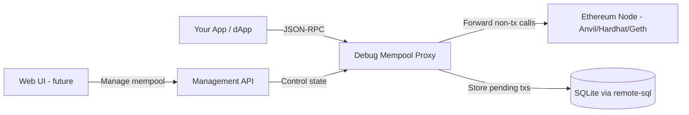

# Debug Mempool Proxy - Project Overview

## Purpose

A proxy server that sits between your application and an Ethereum JSON-RPC node, acting as a configurable mempool manager for debugging and testing purposes. This allows developers to simulate real-world mempool conditions on local development networks where transactions are normally included instantly.

## Problem Statement

Local development nodes like Anvil and Hardhat include transactions immediately, making it impossible to test scenarios involving:
- Pending transactions
- Transaction replacement (speed-up/cancel via higher gas)
- Gas price competition
- Stuck transactions due to nonce gaps
- Mempool congestion behavior

## Solution Architecture



## Key Features

### Transaction Interception
- Intercept `eth_sendRawTransaction` calls
- Decode transaction details using viem
- Store in local mempool instead of immediate forwarding

### Filtering Rules
- **Pause Mode**: Hold all transactions, none forwarded
- **Gas Price Filter**: Reject/hold transactions below minimum gas price
- **Custom Rules**: Extensible filtering based on sender, receiver, value, etc.

### Management API
- Pause/resume mempool forwarding
- Set minimum gas price threshold
- List all pending transactions
- Force-include specific transactions
- Remove transactions from mempool
- Clear entire mempool

### Persistence
- Transactions survive proxy restarts
- Uses remote-sql interface for database abstraction
- SQLite for local development

## Implementation Phases

### Phase 1: Core Proxy Infrastructure
File: [`plans/01-core-proxy.md`](./01-core-proxy.md)
- Basic JSON-RPC proxy setup
- Request/response forwarding
- Health check endpoints

### Phase 2: Mempool Storage Layer
File: [`plans/02-mempool-storage.md`](./02-mempool-storage.md)
- Database schema design
- Transaction storage operations
- State persistence

### Phase 3: Transaction Interception
File: [`plans/03-transaction-interception.md`](./03-transaction-interception.md)
- Intercept `eth_sendRawTransaction`
- Transaction decoding with viem
- Filtering rule engine

### Phase 4: Management API
File: [`plans/04-management-api.md`](./04-management-api.md)
- State control endpoints
- Transaction management endpoints
- Configuration endpoints

### Phase 5: UI Foundation
File: [`plans/05-ui-foundation.md`](./05-ui-foundation.md)
- Web interface for mempool visualization
- Manual transaction management
- Real-time updates

## Technical Stack

- **Framework**: Hono (existing template)
- **Transaction Handling**: viem
- **Database**: SQLite via remote-sql-libsql
- **Platform**: Node.js (primary), Cloudflare Workers (future)
- **Testing**: Vitest

## JSON-RPC Methods Affected

| Method | Behavior |
|--------|----------|
| `eth_sendRawTransaction` | Intercepted, stored in local mempool |
| `eth_getTransactionByHash` | Check local mempool first, then forward |
| `eth_getTransactionReceipt` | Forward to node (only confirmed txs) |
| `eth_getTransactionCount` | May need adjustment for pending nonces |
| All other methods | Pass through to underlying node |

## Directory Structure

```
packages/server/src/
├── api/
│   ├── rpc.ts              # JSON-RPC proxy handler
│   ├── mempool.ts          # Mempool management API
│   └── admin.ts            # Admin/config API
├── mempool/
│   ├── types.ts            # Mempool types
│   ├── state.ts            # Mempool state manager
│   ├── filters.ts          # Filtering rules
│   └── decoder.ts          # Transaction decoder using viem
├── storage/
│   └── mempool.ts          # Database operations for mempool
├── schema/sql/
│   └── mempool.sql         # Mempool tables schema
└── index.ts                # Server entry point
```

## Configuration

Environment variables for the proxy:
- `RPC_URL`: Target Ethereum node URL


## Success Criteria

- Transparent proxy for non-transaction RPC calls
- Reliable transaction interception and storage
- Flexible filtering configuration
- Clean API for programmatic control
- Persistence across restarts
- Easy integration with existing test suites
