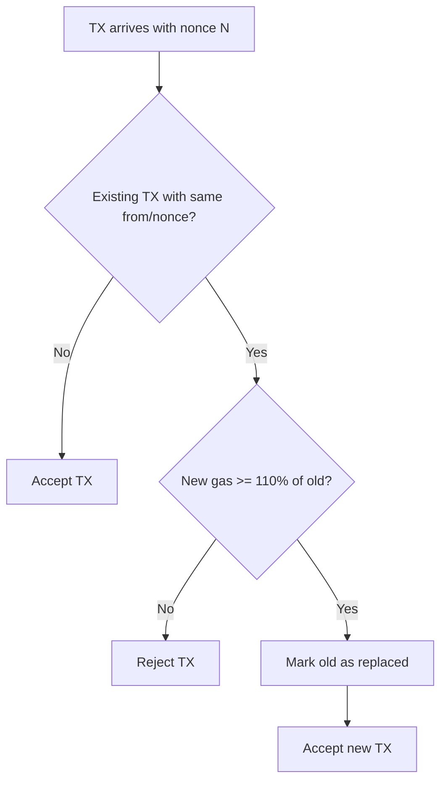
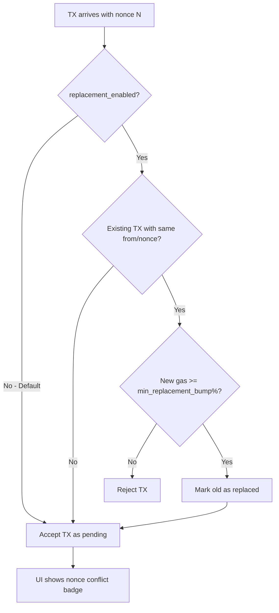

# Debug-Friendly Nonce Handling

## Overview

The current implementation auto-replaces transactions with the same `from/nonce` combination, mimicking production node behavior. For a debugging tool, we want to:

1. **Keep all transactions visible** - no auto-replacement by default
2. **Highlight nonce conflicts** in the UI for easy identification
3. **Make replacement behavior optional** and configurable

## Current Behavior



**Problem:** This hides useful debugging information. Users cannot see all attempted transactions for the same nonce.

## Proposed Behavior



## Implementation Plan

### 1. Database Schema Changes

**File:** [`packages/server/src/schema/sql/db.sql`](packages/server/src/schema/sql/db.sql)

Update the state initialization - remove `paused` (no longer used) and add new keys:

```sql
-- Replace existing INSERT OR IGNORE statement
INSERT OR IGNORE INTO MempoolState (key, value, updated_at) VALUES
    ('min_gas_price', '0', 0),
    ('auto_forward', 'true', 0),
    ('replacement_enabled', 'false', 0),      -- NEW: disabled by default
    ('min_replacement_bump', '10', 0);        -- NEW: 10% when enabled
```

**Note:** The `paused` key is removed as it's no longer used - auto-forward handles this functionality.

### 2. Storage Layer Updates

**File:** [`packages/server/src/storage/mempool.ts`](packages/server/src/storage/mempool.ts)

Add new convenience methods:

```typescript
// Update MempoolStateKey type in types.ts (paused already removed)
export type MempoolStateKey =
  | 'min_gas_price'
  | 'auto_forward'
  | 'replacement_enabled'      // NEW
  | 'min_replacement_bump';    // NEW

// Add to MempoolStorage class
async isReplacementEnabled(): Promise<boolean> {
    const value = await this.getState('replacement_enabled');
    return value === 'true';  // Default false
}

async setReplacementEnabled(enabled: boolean): Promise<void> {
    await this.setState('replacement_enabled', enabled.toString());
}

async getMinReplacementBump(): Promise<number> {
    const value = await this.getState('min_replacement_bump');
    return parseInt(value ?? '10', 10);
}

async setMinReplacementBump(percent: number): Promise<void> {
    await this.setState('min_replacement_bump', percent.toString());
}

// NEW: Get transactions with nonce conflicts for UI highlighting
async getNonceConflicts(): Promise<Map<string, string[]>> {
    const stmt = this.db.prepare(`
        SELECT from_address, nonce, GROUP_CONCAT(hash) as hashes
        FROM PendingTransactions 
        WHERE status = 'pending'
        GROUP BY from_address, nonce
        HAVING COUNT(*) > 1
    `);
    const result = await stmt.bind().all<{
        from_address: string;
        nonce: number;
        hashes: string;
    }>();
    
    const conflicts = new Map<string, string[]>();
    for (const row of result.results) {
        const key = `${row.from_address}:${row.nonce}`;
        conflicts.set(key, row.hashes.split(','));
    }
    return conflicts;
}
```

### 3. Filter Logic Updates

**File:** [`packages/server/src/mempool/filters.ts`](packages/server/src/mempool/filters.ts)

Update `FilterContext` and `applyFilters`:

```typescript
export interface FilterContext {
    storage: MempoolStorage;
    minGasPrice: bigint;
    replacementEnabled: boolean;     // NEW
    minReplacementBump: number;      // NEW
}

export async function applyFilters(
    tx: DecodedTransaction,
    context: FilterContext
): Promise<FilterResult> {
    // Check minimum gas price
    const effectiveGasPrice = getEffectiveGasPrice(tx);
    if (effectiveGasPrice < context.minGasPrice) {
        return {
            accepted: false,
            action: 'reject',
            reason: `Gas price ${effectiveGasPrice} below minimum ${context.minGasPrice}`,
        };
    }

    // Only check replacement if enabled
    if (context.replacementEnabled) {
        const existingTxs = await context.storage.getTransactionsBySender(tx.from);
        const conflicting = existingTxs.find((existing) => existing.nonce === tx.nonce);

        if (conflicting) {
            const existingPrice = conflicting.maxFeePerGas ?? conflicting.gasPrice ?? 0n;
            const newPrice = getEffectiveGasPrice(tx);
            
            // Use configurable bump percentage
            const bumpMultiplier = BigInt(100 + context.minReplacementBump);
            const minReplacementPrice = (existingPrice * bumpMultiplier) / 100n;

            if (newPrice < minReplacementPrice) {
                return {
                    accepted: false,
                    action: 'reject',
                    reason: `Replacement requires ${context.minReplacementBump}% gas bump. Need ${minReplacementPrice}, got ${newPrice}`,
                };
            }

            // Mark existing as replaced
            await context.storage.updateStatus(
                conflicting.hash as Hash,
                'replaced',
                `Replaced by ${tx.hash}`
            );
        }
    }
    // If replacement disabled, just accept - multiple TXs with same nonce allowed

    return {
        accepted: true,
        action: 'accept',
    };
}
```

### 4. State Manager Updates

**File:** [`packages/server/src/mempool/state.ts`](packages/server/src/mempool/state.ts)

Update `MempoolState` interface and `getState`:

```typescript
export interface MempoolState {
    minGasPrice: bigint;
    autoForward: boolean;
    replacementEnabled: boolean;     // NEW
    minReplacementBump: number;      // NEW
}

async getState(): Promise<MempoolState> {
    return {
        minGasPrice: await this.storage.getMinGasPrice(),
        autoForward: await this.storage.isAutoForward(),
        replacementEnabled: await this.storage.isReplacementEnabled(),
        minReplacementBump: await this.storage.getMinReplacementBump(),
    };
}

// Update processTransaction to pass new context
async processTransaction(...) {
    // ...
    const state = await this.getState();
    
    const filterResult = await applyFilters(decoded, {
        storage: this.storage,
        minGasPrice: state.minGasPrice,
        replacementEnabled: state.replacementEnabled,
        minReplacementBump: state.minReplacementBump,
    });
    // ...
}
```

### 5. API Endpoints

**File:** [`packages/server/src/api/mempool.ts`](packages/server/src/api/mempool.ts)

Add new endpoints for replacement settings:

```typescript
// POST /api/mempool/replacement-mode
app.post('/api/mempool/replacement-mode', async (c) => {
    const body = await c.req.json<{ enabled: boolean }>();
    const manager = getMempoolManager(c);
    await manager.storage.setReplacementEnabled(body.enabled);
    return c.json({ success: true, replacementEnabled: body.enabled });
});

// POST /api/mempool/replacement-bump
app.post('/api/mempool/replacement-bump', async (c) => {
    const body = await c.req.json<{ percent: number }>();
    if (body.percent < 0 || body.percent > 1000) {
        return c.json({ error: 'Percent must be 0-1000' }, 400);
    }
    const manager = getMempoolManager(c);
    await manager.storage.setMinReplacementBump(body.percent);
    return c.json({ success: true, minReplacementBump: body.percent });
});
```

### 6. UI Updates

#### 6.1 Transaction List with Conflict Highlighting

**File:** [`packages/server/src/ui/components/transaction-list.ts`](packages/server/src/ui/components/transaction-list.ts)

```typescript
export function transactionList(
    transactions: PendingTransaction[],
    conflicts?: Map<string, string[]>  // NEW: pass conflict data
) {
    // Build conflict lookup
    const hasConflict = (tx: PendingTransaction) => {
        const key = `${tx.from.toLowerCase()}:${tx.nonce}`;
        return conflicts?.has(key) ?? false;
    };

    // In the table row rendering:
    return html`
        <tr class="${hasConflict(tx) ? 'nonce-conflict' : ''}">
            <!-- ... existing columns ... -->
            <td>
                ${tx.nonce}
                ${hasConflict(tx) ? html`<span class="conflict-badge" title="Multiple TXs with same nonce">⚠️</span>` : ''}
            </td>
            <!-- ... -->
        </tr>
    `;
}
```

#### 6.2 CSS for Conflict Highlighting

**File:** [`packages/server/src/ui/static/dashboard.css`](packages/server/src/ui/static/dashboard.css)

```css
/* Nonce conflict highlighting */
tr.nonce-conflict {
    background-color: rgba(255, 193, 7, 0.15);
    border-left: 3px solid #ffc107;
}

tr.nonce-conflict:hover {
    background-color: rgba(255, 193, 7, 0.25);
}

.conflict-badge {
    margin-left: 0.5rem;
    cursor: help;
}
```

#### 6.3 State Controls with Replacement Settings

**File:** [`packages/server/src/ui/components/state-controls.ts`](packages/server/src/ui/components/state-controls.ts)

Add replacement mode toggle:

```typescript
export interface StateControlsProps {
    minGasPrice: bigint;
    autoForward: boolean;
    replacementEnabled: boolean;    // NEW
    minReplacementBump: number;     // NEW
}

// In the template, add:
<div class="settings-group">
    <strong>Replacement Mode:</strong>
    ${state.replacementEnabled
        ? html`
            <span class="status-badge status-forwarded">Node-like</span>
            <button class="btn btn-sm" onclick="toggleReplacement(false)">
                Switch to Debug
            </button>
          `
        : html`
            <span class="status-badge status-pending">Debug</span>
            <button class="btn btn-sm" onclick="toggleReplacement(true)">
                Switch to Node-like
            </button>
          `}
</div>

${state.replacementEnabled ? html`
    <div style="display: flex; align-items: center; gap: 0.5rem;">
        <label>Min Gas Bump:</label>
        <input type="number" id="replacement-bump" value="${state.minReplacementBump}" min="0" max="1000" style="width: 80px;" />
        <span>%</span>
        <button class="btn btn-sm" onclick="setReplacementBump()">Set</button>
    </div>
` : ''}

<script>
function toggleReplacement(enabled) {
    fetch('/api/mempool/replacement-mode', {
        method: 'POST',
        headers: { 'Content-Type': 'application/json' },
        body: JSON.stringify({ enabled })
    }).then(() => htmx.trigger('#state-controls', 'htmx:load'));
}

function setReplacementBump() {
    const input = document.getElementById('replacement-bump');
    const percent = parseInt(input.value, 10);
    fetch('/api/mempool/replacement-bump', {
        method: 'POST',
        headers: { 'Content-Type': 'application/json' },
        body: JSON.stringify({ percent })
    }).then(() => htmx.trigger('#state-controls', 'htmx:load'));
}
</script>
```

### 7. Test Updates

**Files to update:**
- [`packages/server/test/mempool/filters.test.ts`](packages/server/test/mempool/filters.test.ts)
- [`packages/server/test/mempool/state.test.ts`](packages/server/test/mempool/state.test.ts)
- [`packages/server/test/storage/mempool.test.ts`](packages/server/test/storage/mempool.test.ts)

Key test scenarios:

1. **Default behavior:** Multiple TXs with same nonce accepted when `replacement_enabled=false`
2. **Node-like mode:** Replacement enforced when `replacement_enabled=true`
3. **Configurable bump:** Different bump percentages work correctly
4. **UI conflicts:** Conflict detection returns correct data

## Summary of Changes

| File | Changes |
|------|---------|
| `schema/sql/db.sql` | Add `replacement_enabled`, `min_replacement_bump` state keys |
| `mempool/types.ts` | Extend `MempoolStateKey` type |
| `storage/mempool.ts` | Add methods for new settings + conflict detection |
| `mempool/filters.ts` | Make replacement conditional on settings |
| `mempool/state.ts` | Update state interface and context passing |
| `api/mempool.ts` | Add API endpoints for new settings |
| `ui/components/transaction-list.ts` | Add conflict highlighting |
| `ui/components/state-controls.ts` | Add replacement mode toggle |
| `ui/static/dashboard.css` | Add conflict styles |
| Tests | Update for new default behavior |

## Migration Notes

- Existing installations will default to `replacement_enabled=false` (debug mode)
- No data migration needed - just new state keys with defaults
- UI will automatically show conflict highlighting for existing data
